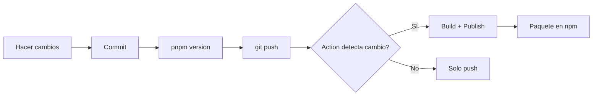

# 🤖 GitHub Actions - Automatización

Este documento describe las GitHub Actions configuradas en el proyecto.

## 📋 Actions Disponibles

### 1. Update Twitch Badges (`update-badges.yml`)

**Propósito**: Actualizar automáticamente los badges desde la API de Twitch.

**Disparadores**:
- **Programado**: Cada lunes a las 00:00 UTC
- **Manual**: Desde la pestaña Actions en GitHub

**Proceso**:
1. Clona el repositorio
2. Configura Node.js y pnpm
3. Instala dependencias
4. Ejecuta `pnpm update-badges`
5. Hace commit y push automático si hay cambios en `badges/*.json`

**Commits generados**: `🎖️ Update Twitch badges`

---

### 2. Publish to NPM (`publish-npm.yml`)

**Propósito**: Publicar automáticamente en npm cuando cambia la versión en `package.json`.

**Disparadores**:
- Push a la rama `main` con cambios en `package.json`

**Proceso**:
1. **Job 1 - Check Version**:
   - Verifica si la versión en `package.json` cambió
   - Compara el commit actual con el anterior
   - Pasa el resultado al siguiente job

2. **Job 2 - Publish** (solo si cambió la versión):
   - Instala dependencias
   - Compila el código con `pnpm build`
   - Publica en npm con `pnpm publish --access public`

**Requisitos**:
- Secret `NPM_TOKEN` configurado en GitHub

**Ejemplo de uso**:
```bash
pnpm version patch
git push && git push --tags
```

---

### 3. Publish to NPM by Tag (`publish-npm-tag.yml`)

**Propósito**: Publicar en npm mediante tags de versión.

**Disparadores**:
- Push de tags con formato `v*.*.*` (ej: `v1.0.0`, `v2.3.1`)

**Proceso**:
1. Extrae la versión del tag
2. Instala dependencias
3. Compila el código
4. Publica en npm

**Requisitos**:
- Secret `NPM_TOKEN` configurado en GitHub

**Ejemplo de uso**:
```bash
git tag v1.0.1
git push origin v1.0.1
```

---

## 🔐 Configuración de Secrets

### NPM_TOKEN

Para que las actions de publicación funcionen, necesitas configurar el token de npm:

#### Paso 1: Generar Token de NPM

1. Inicia sesión en [npmjs.com](https://www.npmjs.com/)
2. Ve a tu perfil → **Access Tokens**
3. Haz clic en **Generate New Token** → **Classic Token**
4. Selecciona **Automation** como tipo de token
5. Copia el token generado (solo se muestra una vez)

#### Paso 2: Configurar en GitHub

1. Ve a tu repositorio en GitHub
2. **Settings** → **Secrets and variables** → **Actions**
3. Haz clic en **New repository secret**
4. Configura:
   - **Name**: `NPM_TOKEN`
   - **Secret**: Pega tu token de npm
5. Guarda el secret

#### Paso 3: Verificar

Haz un cambio de versión para probar:

```bash
pnpm version patch
git push && git push --tags
```

Ve a la pestaña **Actions** en GitHub para ver el progreso.

---

## 📊 Workflows y Permisos

### Permisos Requeridos

- **update-badges.yml**: `contents: write` (para hacer commits)
- **publish-npm.yml**: `contents: read` (solo lectura)
- **publish-npm-tag.yml**: `contents: read` (solo lectura)

### Variables de Entorno

Las actions usan estas variables:

- `NODE_AUTH_TOKEN`: Token de npm (desde secrets)
- `GITHUB_REF`: Referencia del commit/tag actual
- `GITHUB_OUTPUT`: Para pasar datos entre steps

---

## 🚦 Estados y Notificaciones

Cada action muestra su estado en:
- **Badge en README**: Puedes agregar badges de estado
- **Pestaña Actions**: Ver historial de ejecuciones
- **Commits**: Las actions dejan comentarios con resultados

### Badges de Estado (Opcional)

Puedes agregar estos badges al README:

```markdown
[](https://github.com/chrisvdev/mtmi-async-badges/actions/workflows/update-badges.yml)

[](https://github.com/chrisvdev/mtmi-async-badges/actions/workflows/publish-npm.yml)
```

---

## 🐛 Troubleshooting

### La publicación falla con "401 Unauthorized"

**Causa**: Token de npm inválido o expirado  
**Solución**: Genera un nuevo token y actualiza el secret `NPM_TOKEN`

### La action no detecta el cambio de versión

**Causa**: El archivo `package.json` no cambió o el commit no incluye cambios en version  
**Solución**: Asegúrate de que `pnpm version` creó un commit con el cambio

### "Package already exists"

**Causa**: La versión ya fue publicada en npm  
**Solución**: Incrementa la versión con `pnpm version patch/minor/major`

### No se ejecuta la action de update-badges

**Causa**: El workflow schedule puede tardar en activarse  
**Solución**: Ejecuta manualmente desde Actions → Update Twitch Badges → Run workflow

---

## 📝 Mejores Prácticas

1. **Versiones semánticas**: Usa siempre versiones semánticas (semver)
2. **Changelog**: Mantén un CHANGELOG.md actualizado
3. **Tests**: Agrega tests antes de publicar (opcional, futuro)
4. **Branch protection**: Protege la rama main para evitar publicaciones accidentales
5. **Review**: Usa pull requests para cambios importantes

---

## 🔄 Flujo de Trabajo Recomendado



1. Desarrolla y testea localmente
2. Haz commit de tus cambios
3. Actualiza la versión con `pnpm version`
4. Push de cambios y tags
5. GitHub Action se encarga de publicar

---

## 📚 Referencias

- [GitHub Actions Documentation](https://docs.github.com/en/actions)
- [NPM Publishing Guide](https://docs.npmjs.com/packages-and-modules/contributing-packages-to-the-registry)
- [Semantic Versioning](https://semver.org/)
