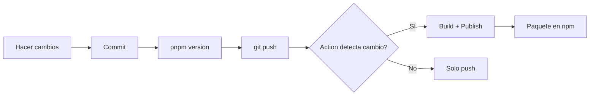

# 🤖 GitHub Actions - Automatización

Este documento describe las GitHub Actions configuradas en el proyecto.

## 📋 Actions Disponibles

Este proyecto tiene 2 workflows configurados:

1. **Update Twitch Badges** - Actualización semanal automática de badges
2. **Publish to NPM and Create Release** - Publicación manual a npm y creación de releases

### 1. Update Twitch Badges (`update-badges.yml`)

**Propósito**: Actualizar automáticamente los badges desde la API de Twitch.

**Disparadores**:
- **Programado**: Cada lunes a las 00:00 UTC (automático)
- **Manual**: Desde la pestaña Actions en GitHub o vía `gh workflow run update-badges.yml`

**Proceso**:
1. Clona el repositorio
2. Configura Node.js y pnpm
3. Instala dependencias
4. Ejecuta `pnpm update-badges`
5. Hace commit y push automático si hay cambios en `badges/*.json`

**Commits generados**: `🎖️ Update Twitch badges`

**Ejemplo de ejecución manual con gh CLI**:
```bash
gh workflow run update-badges.yml
```

---

### 2. Publish to NPM and Create Release (`publish-npm.yml`)

**Propósito**: Publicar manualmente una nueva versión en npm y crear un release en GitHub.

**Disparadores**:
- **Manual únicamente**: Desde la pestaña Actions en GitHub o vía `gh workflow run`

**Inputs requeridos**:
- `version`: Versión a publicar (ej: `1.0.5`, `1.1.0`, `2.0.0`)

**Proceso**:
1. Actualiza la versión en `package.json`
2. Hace commit del cambio de versión
3. Instala dependencias
4. Compila el código con `pnpm build`
5. Publica en npm con `pnpm publish --access public`
6. Crea un tag de Git con la versión
7. Genera un changelog automático desde el último tag
8. Crea un GitHub Release con documentación completa

**Requisitos**:
- Secret `NPM_TOKEN` configurado en GitHub
- Permisos: `contents: write` (para crear tags y releases)

**Ejemplo de uso con gh CLI**:
```bash
# Publicar versión 1.0.5
gh workflow run publish-npm.yml -f version=1.0.5

# Publicar versión 1.1.0
gh workflow run publish-npm.yml -f version=1.1.0
```

**Ejemplo de uso desde GitHub Web**:
1. Ve a la pestaña **Actions**
2. Selecciona **Publish to NPM and Create Release**
3. Click en **Run workflow**
4. Ingresa la versión (ej: `1.0.5`)
5. Click en **Run workflow**

**Resultado**: 
- Paquete publicado en npm
- Tag `v1.0.5` creado en Git
- Release en GitHub con changelog automático

---

## 🔒 Secrets Necesarios

Los siguientes secrets deben estar configurados en GitHub:

- `NPM_TOKEN`: Token de npm con permisos de publicación
  - Obtenerlo en: https://www.npmjs.com/settings/YOUR_USERNAME/tokens
  - Tipo: Automation token
  - Configurarlo en: Settings → Secrets and variables → Actions → New repository secret

---

## 📝 Notas Importantes

### Flujo de Trabajo Recomendado

1. **Desarrollo normal**:
   - Haz commits y push normalmente a `main`
   - Los workflows NO se ejecutarán automáticamente

2. **Actualización de badges** (automática):
   - Se ejecuta cada lunes automáticamente
   - También puedes ejecutarla manualmente cuando quieras

3. **Publicar nueva versión**:
   ```bash
   # Opción 1: Desde CLI
   gh workflow run publish-npm.yml -f version=1.0.5
   
   # Opción 2: Desde la web de GitHub
   # Actions → Publish to NPM and Create Release → Run workflow
   ```

### Versionado Semántico

Sigue [Semantic Versioning](https://semver.org/):
- **MAJOR** (`2.0.0`): Cambios incompatibles con versiones anteriores
- **MINOR** (`1.1.0`): Nueva funcionalidad compatible
- **PATCH** (`1.0.1`): Correcciones de bugs

### Changelog Automático

El workflow genera automáticamente un changelog basado en los commits desde el último tag. Para mejores changelogs, usa commits descriptivos con prefijos:
- `feat:` - Nueva funcionalidad
- `fix:` - Corrección de bugs
- `docs:` - Cambios en documentación  
- `chore:` - Tareas de mantenimiento
- `refactor:` - Refactorización de código
2. Encuentra el tag anterior
3. Genera un changelog automático con los commits entre versiones
4. Crea un GitHub Release con:
   - Título formateado
   - Changelog de cambios
   - Información de instalación y uso
   - Enlaces a documentación

**Permisos**:
- `contents: write` (para crear releases)

**Nota**: Este workflow es redundante con la nueva funcionalidad de `publish-npm.yml`, pero se mantiene como respaldo.

---

## 🔐 Configuración de Secrets

### NPM_TOKEN

Para que las actions de publicación funcionen, necesitas configurar el token de npm:

#### Paso 1: Generar Token de NPM

1. Inicia sesión en [npmjs.com](https://www.npmjs.com/)
2. Ve a tu perfil → **Access Tokens**
3. Haz clic en **Generate New Token** → **Classic Token**
4. Selecciona **Automation** como tipo de token
5. Copia el token generado (solo se muestra una vez)

#### Paso 2: Configurar en GitHub

1. Ve a tu repositorio en GitHub
2. **Settings** → **Secrets and variables** → **Actions**
3. Haz clic en **New repository secret**
4. Configura:
   - **Name**: `NPM_TOKEN`
   - **Secret**: Pega tu token de npm
5. Guarda el secret

#### Paso 3: Verificar

Haz un cambio de versión para probar:

```bash
pnpm version patch
git push && git push --tags
```

Ve a la pestaña **Actions** en GitHub para ver el progreso.

---

## 📊 Workflows y Permisos

### Permisos Requeridos

- **update-badges.yml**: `contents: write` (para hacer commits)
- **publish-npm.yml**: `contents: write` (para crear tags y releases)
- **publish-npm-tag.yml**: `contents: read` (solo lectura)
- **create-release.yml**: `contents: write` (para crear releases)

### Variables de Entorno

Las actions usan estas variables:

- `NODE_AUTH_TOKEN`: Token de npm (desde secrets)
- `GITHUB_REF`: Referencia del commit/tag actual
- `GITHUB_OUTPUT`: Para pasar datos entre steps

---

## 🚦 Estados y Notificaciones

Cada action muestra su estado en:
- **Badge en README**: Puedes agregar badges de estado
- **Pestaña Actions**: Ver historial de ejecuciones
- **Commits**: Las actions dejan comentarios con resultados

### Badges de Estado (Opcional)

Puedes agregar estos badges al README:

```markdown
[](https://github.com/chrisvdev/mtmi-async-badges/actions/workflows/update-badges.yml)

[](https://github.com/chrisvdev/mtmi-async-badges/actions/workflows/publish-npm.yml)
```

---

## 🐛 Troubleshooting

### La publicación falla con "401 Unauthorized"

**Causa**: Token de npm inválido o expirado  
**Solución**: Genera un nuevo token y actualiza el secret `NPM_TOKEN`

### La action no detecta el cambio de versión

**Causa**: El archivo `package.json` no cambió o el commit no incluye cambios en version  
**Solución**: Asegúrate de que `pnpm version` creó un commit con el cambio

### "Package already exists"

**Causa**: La versión ya fue publicada en npm  
**Solución**: Incrementa la versión con `pnpm version patch/minor/major`

### No se ejecuta la action de update-badges

**Causa**: El workflow schedule puede tardar en activarse  
**Solución**: Ejecuta manualmente desde Actions → Update Twitch Badges → Run workflow

---

## 📝 Mejores Prácticas

1. **Versiones semánticas**: Usa siempre versiones semánticas (semver)
2. **Changelog**: Mantén un CHANGELOG.md actualizado
3. **Tests**: Agrega tests antes de publicar (opcional, futuro)
4. **Branch protection**: Protege la rama main para evitar publicaciones accidentales
5. **Review**: Usa pull requests para cambios importantes

---

## 🔄 Flujo de Trabajo Recomendado



1. Desarrolla y testea localmente
2. Haz commit de tus cambios
3. Actualiza la versión con `pnpm version`
4. Push de cambios y tags
5. GitHub Action se encarga de publicar

---

## 📚 Referencias

- [GitHub Actions Documentation](https://docs.github.com/en/actions)
- [NPM Publishing Guide](https://docs.npmjs.com/packages-and-modules/contributing-packages-to-the-registry)
- [Semantic Versioning](https://semver.org/)
